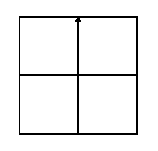

### Теория: Рисование фигур с помощью циклов

Цикл — это конструкция, которая позволяет выполнять один и тот же блок кода несколько раз подряд. В Python самый популярный цикл для таких задач — это `for`.
```python
for i in range(КОЛИЧЕСТВО_ПОВТОРОВ):
    # Здесь пишем команды, которые нужно повторить
    # Эти команды обязательно должны быть с отступом (tab)
    t.forward(100)
    t.left(90)
```

- `for` — ключевое слово, начало цикла
- `i` — это переменная-счетчик
- `in range(n)` — задает диапазон повторений от 0 до n-1
- Двоеточие (`:`) в конце строки с `for` обязательно
- Отступ (4 пробела) перед командами внутри цикла обязателен

**Пример с черепашкой**

```python
import turtle

t = turtle.Turtle()
t.width(5)

for i in range(3):
    t.forward(100)
    t.left(120)

turtle.done()
```

---

### Практика (нельзя гуглить и использовать ИИ)

#### Задание 1: Квадрат
1. Название файла `square.py`
2. Нарисуй квадрат используя цикл `for`

#### Задание 2: Шестиугольник
1. Название файла `hexagon.py`
2. Нарисуй шестиугольник используя цикл `for`

#### Задание 3: Окно
1. Название файла `window.py`
2. Нарисуй окно используя цикл `for` и команды `forward`, `left`, `right`, `up`, `down`



**Задание 4 (Дополнительное, для тех, кто все сделал): Окружность**
Знаешь ли ты, что окружность — это тоже многоугольник, просто с очень большим количеством очень маленьких сторон? Попробуй нарисовать круг с помощью цикла.
*Подсказка:* Возьми очень маленький шаг вперед, например, `t.forward(5)`, и очень маленький поворот, например, `t.right(5)`. Создай файл `circle.py` и поэкспериментируй с числами.